# CartoonCare

> Personalized AI-powered storybooks for children facing medical challenges.

CartoonCare turns difficult medical experiences into illustrated adventures. Parents enter their child's name, age, condition, and personality — and the platform generates a unique, Studio Ghibli–style storybook in which their child is the hero. Stories can be narrated aloud and translated into 10+ languages.

[](https://github.com/ananyamishra24/2nd-year-AIML-Mini-project/actions/workflows/ci.yml)

---

## Table of Contents

- [Features](#features)
- [Tech Stack](#tech-stack)
- [Architecture](#architecture)
- [Getting Started](#getting-started)
- [Environment Variables](#environment-variables)
- [Testing](#testing)
- [Security](#security)
- [Project Structure](#project-structure)
- [Screenshots](#screenshots)
- [License](#license)

---

## Features

- **Personalized stories** — generated around the child's name, age, medical condition, and traits
- **Studio Ghibli illustrations** — every page rendered in cel-animation style via Azure gpt-image-1.5
- **Expressive narration** — Azure `gpt-4o-mini-tts` with a child-audience steering prompt; 10 voices
- **Translation** — Azure AI Translator with hero-name protection across 10+ languages, including RTL (Arabic, Urdu)
- **Moonface** — optional camera-based hero auto-fill using GPT-4o vision (skin tone, hair style, hair color)
- **Hero Character Builder** — customize skin tone, hair, outfit, accessory, medical detail, and birth marks
- **Authentication** — email/password (PBKDF2 + JWT) and Google Sign-In
- **Story library** — save, favorite, revisit, and delete generated stories
- **Cloud storage** — pluggable backend (local filesystem, AWS S3, or Azure Blob)
- **Admin dashboard** — uptime, memory, error rate, AI generation time breakdowns
- **User data isolation** — every protected route filters by `user_id` from the JWT

---

## Tech Stack

| Layer | Technology |
|-------|------------|
| Frontend | Vanilla HTML / CSS / JavaScript (no build step) |
| Backend | Python 3.11+, Flask (Blueprint architecture) |
| Database | SQLite (default) or PostgreSQL via `DATABASE_URL` |
| Auth | JWT (HS256), PBKDF2 password hashing, Google Sign-In |
| Story text | Anthropic Claude Sonnet 4.6 (via Azure AI Foundry) |
| Story illustrations | Azure OpenAI gpt-image-1.5 |
| Narration | Azure OpenAI gpt-4o-mini-tts |
| Translation | Azure AI Translator v3.0 |
| Vision (Moonface) | Azure OpenAI GPT-4o |
| Storage | Local / AWS S3 (presigned URLs) / Azure Blob |
| Rate limiting | Flask-Limiter |

---

## Architecture

```
┌─────────────┐     ┌──────────────────────────────┐     ┌─────────────────────────┐
│  Browser    │ ──► │  Flask app (server/main.py)  │ ──► │  Claude Sonnet 4.6      │
│ (vanilla JS)│     │  • auth / stories / health   │     │  Azure gpt-image-1.5    │
└─────────────┘     │  • speech / translation      │     │  Azure gpt-4o-mini-tts  │
                    │  • moonface / credits        │     │  Azure AI Translator    │
                    └──────────────┬───────────────┘     │  Azure GPT-4o (vision)  │
                                   │                     └─────────────────────────┘
                                   ▼
                       ┌───────────────────────┐
                       │  SQLite / PostgreSQL  │
                       │  Local / S3 / Azure   │
                       └───────────────────────┘
```

---

## Getting Started

### 1. Clone

```bash
git clone https://github.com/ananyamishra24/2nd-year-AIML-Mini-project.git
cd 2nd-year-AIML-Mini-project
```

### 2. Create a virtual environment

```bash
python -m venv .venv
.venv\Scripts\activate          # Windows (cmd)
.venv\Scripts\Activate.ps1      # Windows (PowerShell)
source .venv/bin/activate       # macOS / Linux
```

### 3. Install dependencies

```bash
pip install -r requirements.txt
```

### 4. Configure secrets

Copy `.env.example` to `.env` and fill in your keys (see [Environment Variables](#environment-variables) below).

### 5. Run the server

```bash
python server/main.py
```

Open http://localhost:5002.

---

## Environment Variables

| Variable | Required | Purpose |
|----------|:--------:|---------|
| `CLAUDE_API_KEY` | Yes | Azure AI Foundry key for the Anthropic-compatible Claude deployment |
| `CLAUDE_ENDPOINT` | Yes | Base URL, e.g. `https://<resource>.services.ai.azure.com/anthropic` |
| `CLAUDE_MODEL` | No | Model ID exposed via the endpoint (default: `claude-sonnet-4-6`) |
| `AZURE_GPT_IMAGE_API_KEY` | Yes | Azure OpenAI key for gpt-image-1.5 |
| `AZURE_GPT_IMAGE_ENDPOINT` | Yes | Full Azure endpoint URL (deployment + api-version) |
| `AZURE_TTS_API_KEY` | TTS | Azure OpenAI key for gpt-4o-mini-tts |
| `AZURE_TTS_ENDPOINT` | TTS | Full deployment URL with api-version query |
| `AZURE_TRANSLATOR_KEY` | Translation | Azure AI Translator subscription key |
| `AZURE_TRANSLATOR_ENDPOINT` | Translation | Default `https://api.cognitive.microsofttranslator.com/` |
| `AZURE_TRANSLATOR_REGION` | Translation | Region for multi-service resources (e.g. `eastus2`) |
| `GPT4O_VISION_API_KEY` | Moonface | Azure OpenAI key for GPT-4o |
| `GPT4O_VISION_ENDPOINT` | Moonface | Full endpoint for GPT-4o chat completions |
| `JWT_SECRET_KEY` | No | Auto-generated if missing |
| `TOKEN_EXPIRY_HOURS` | No | JWT lifetime (default: 72) |
| `DATABASE_URL` | No | Empty = SQLite; `postgres://...` for PostgreSQL |
| `STORAGE_BACKEND` | No | `local` (default), `s3`, or `azure` |
| `CORS_ALLOWED_ORIGINS` | No | Comma-separated allowed origins |
| `GOOGLE_CLIENT_ID` | No | Enables Google Sign-In when set |

See `.env.example` for the full list.

---

## Testing

```bash
# Full suite with coverage
python -m pytest tests/ -v --cov=server --cov-report=term-missing

# Single file
python -m pytest tests/test_auth.py -v

# By keyword
python -m pytest -k "isolation" -v
```

**Test suites:**

| File | Coverage |
|------|----------|
| `test_auth.py` | Password hashing, JWT create/decode/tamper, registration validation, register/login/protected routes |
| `test_character_builder.py` | Hero character builder description rendering and story-endpoint persistence |
| `test_content_safety.py` | Input validation, prompt-injection blocking, output moderation |
| `test_data_isolation.py` | Cross-user access denied for stories, children, favorites, preferences |

CI runs `flake8` plus the full pytest suite on every push and pull request via [.github/workflows/ci.yml](.github/workflows/ci.yml).

---

## Security

CartoonCare applies defense-in-depth across the full stack.

### Authentication & authorization

- PBKDF2 password hashing with per-user salt
- JWT (HS256) sent via `Authorization: Bearer` header — never cookies, so CSRF has no vector
- `@login_required` decorator extracts `user_id` from the JWT into `g.user_id`
- Every protected route filters DB queries by `g.user_id`; cross-user access returns 403/404
- Google Sign-In tokens verified server-side via `google.oauth2.id_token.verify_oauth2_token`

### Input & output safety

- All user inputs (name, age, condition, traits) validated server-side before AI calls
- `sanitize_html()` strips tags, neutralizes `javascript:` URIs and inline event handlers, escapes HTML entities
- Blocked-terms filter and prompt-injection detection in `content_safety.py`
- AI output moderation pass before persistence

### Database

- Parameterized queries everywhere via `_execute()` — no raw string formatting
- `update_child()` enforces an `ALLOWED_COLUMNS` whitelist for dynamic updates
- No `SELECT *` queries

### Network & headers

| Header | Value |
|--------|-------|
| `X-Content-Type-Options` | `nosniff` |
| `X-Frame-Options` | `DENY` |
| `Strict-Transport-Security` | `max-age=31536000; includeSubDomains` |
| `Content-Security-Policy` | `default-src 'self'` |
| `Referrer-Policy` | `strict-origin-when-cross-origin` |
| `Permissions-Policy` | `camera=(self), microphone=(), geolocation=()` |

CORS is restricted to origins listed in `CORS_ALLOWED_ORIGINS` (no wildcards).

### Rate limiting

- Global: 200 requests/day, 60/hour per IP
- Auth routes: 10/minute
- Story generation: 5/minute

### API key handling

- All Azure keys (TTS, gpt-image, gpt-4o, Translator) are kept server-side and proxied — never exposed to the frontend
- TTS voice IDs validated against a server-side allowlist before forwarding to Azure

---

## Project Structure

```
brave-story-maker/
├── client/                          # Vanilla HTML/CSS/JS frontend (no build step)
│   ├── index.html                   # Story library
│   ├── create.html                  # Story creation form + character builder
│   ├── story.html                   # Viewer with narration & translation
│   ├── profiles.html                # Hero selector + Manage Heroes mode
│   ├── account.html                 # Account settings
│   ├── login.html                   # Email/password + Google Sign-In
│   ├── feedback.html                # Help & support / story rating
│   ├── my-credits.html              # User credit dashboard
│   ├── admin-credits.html           # Admin dashboard
│   ├── css/                         # styles.css, dashboard.css
│   ├── js/                          # one JS file per page
│   └── images/                      # static UI assets
├── server/
│   ├── main.py                      # App factory, middleware, static serving
│   ├── auth.py                      # JWT, PBKDF2, @login_required
│   ├── database_v2.py               # SQLite + PostgreSQL data layer
│   ├── cloud_storage.py             # Local / S3 / Azure Blob abstraction
│   ├── content_safety.py            # Input validation & moderation
│   ├── prompt_manager.py            # Claude prompts + Studio Ghibli image prompts
│   ├── tts_engine.py                # Azure gpt-4o-mini-tts client
│   ├── translator.py                # Azure AI Translator client
│   ├── monitoring.py                # Structured logging & API usage tracking
│   └── routes/
│       ├── auth.py                  # /api/auth/*
│       ├── stories.py               # /api/stories/*, /api/children/*
│       ├── speech.py                # /api/tts, /api/tts/config
│       ├── translation.py           # /api/translate, /api/translate/config
│       ├── moonface.py              # /api/moonface/analyze
│       ├── credits.py               # /api/credits/*
│       └── health.py                # /api/health, /api/admin/stats
├── tests/                           # pytest suite — see Testing section
├── .github/workflows/ci.yml         # flake8 + pytest on push/PR
├── requirements.txt
├── .env.example
└── README.md
```

---

## Screenshots

### Authentication

| Login | Sign Up |
|:-----:|:-------:|
| 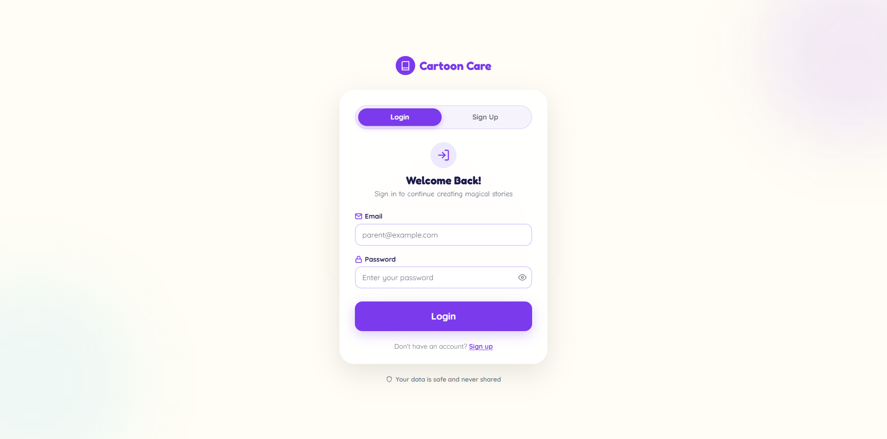 | 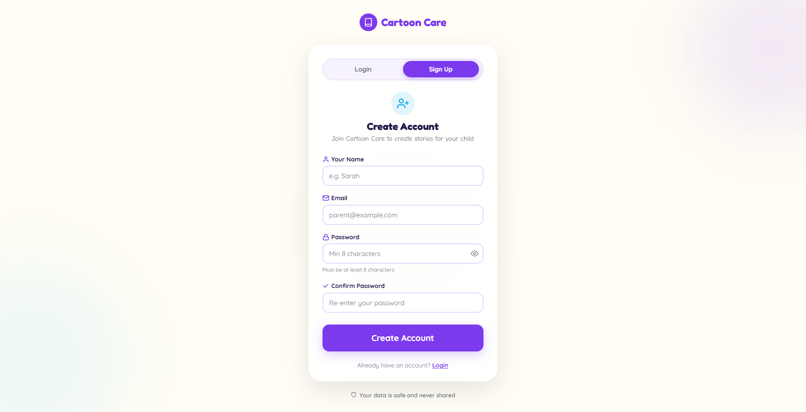 |

### Story Library

| With stories | Empty state |
|:------------:|:-----------:|
| 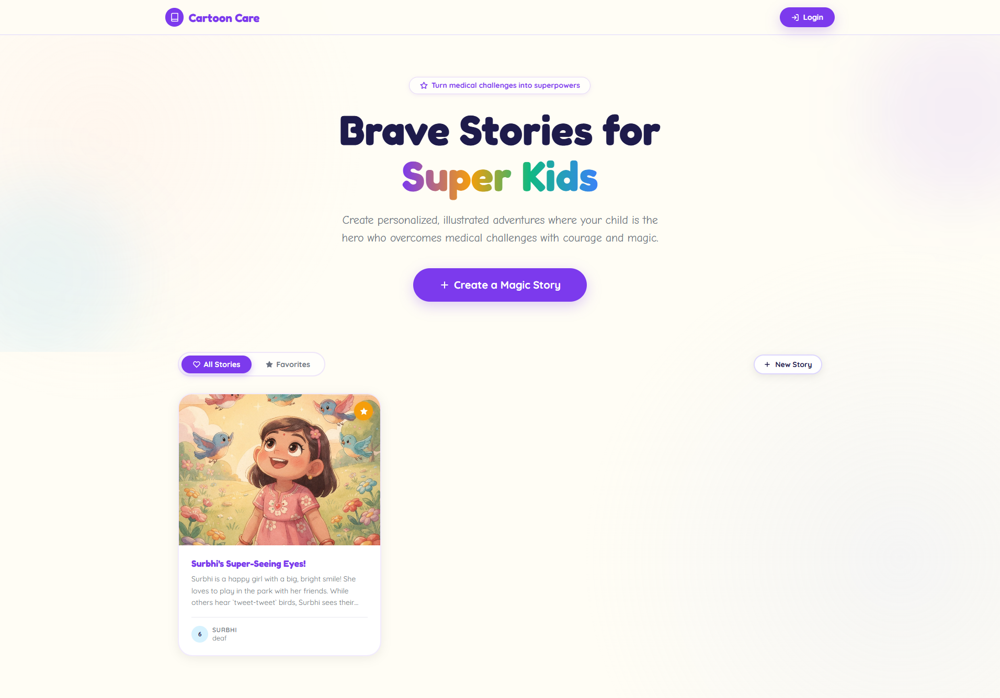 | 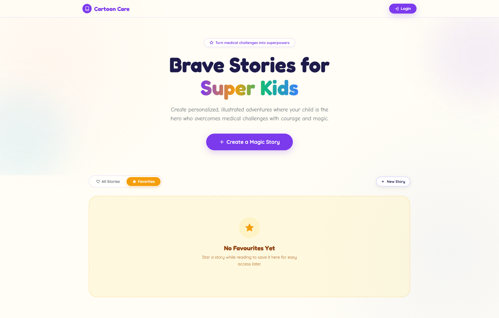 |

### Create a Story

| Empty form | Filled form | Custom settings |
|:----------:|:-----------:|:---------------:|
| 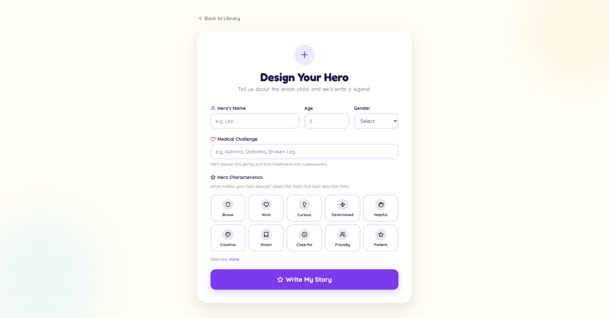 | 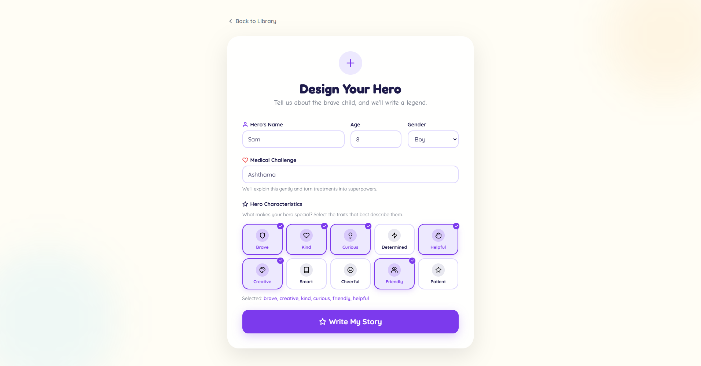 | 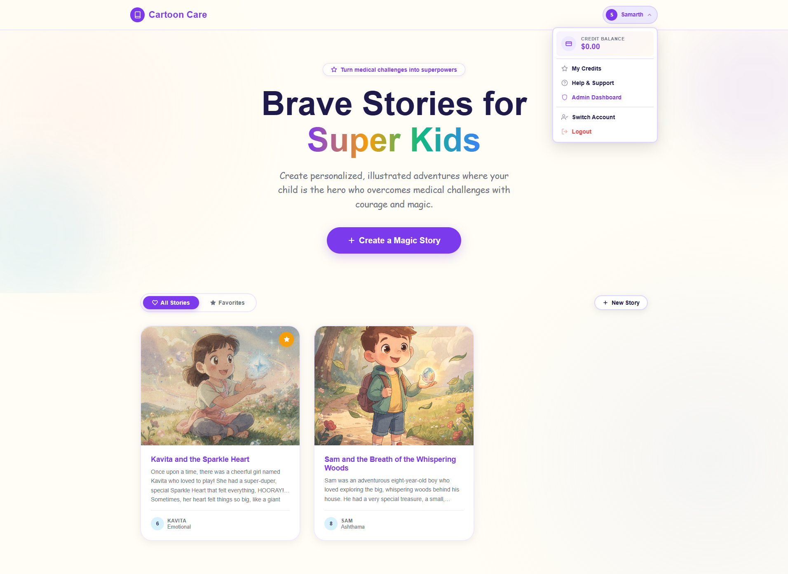 |

| Generating |
|:----------:|
| 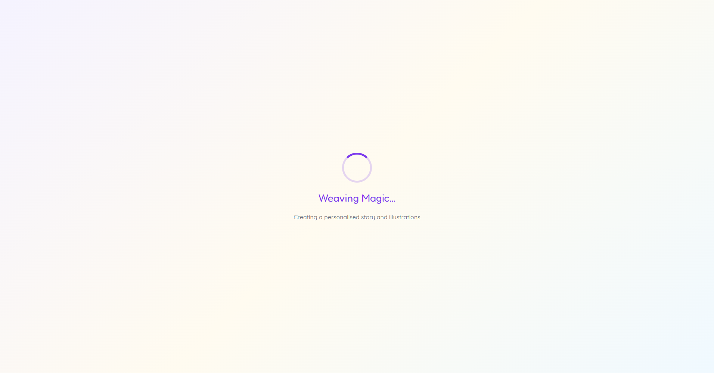 |

### Story Viewer

| Page 1 | Page 2 |
|:------:|:------:|
| 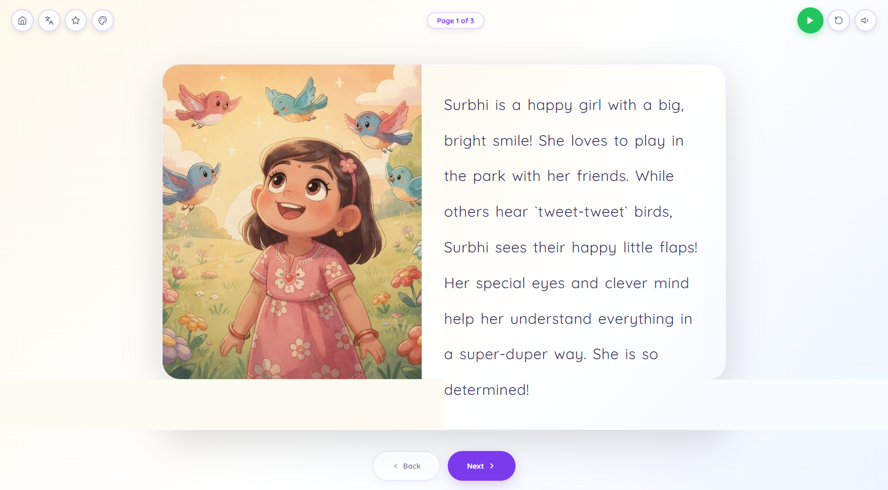 | 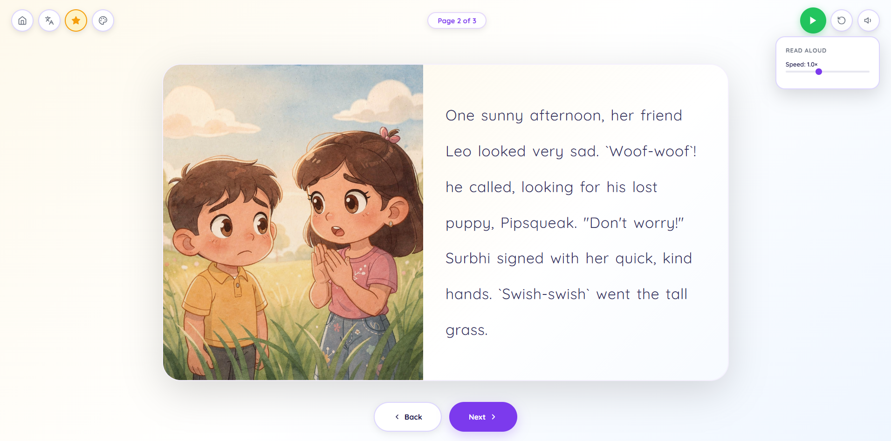 |

| Narration | Translation |
|:---------:|:-----------:|
| 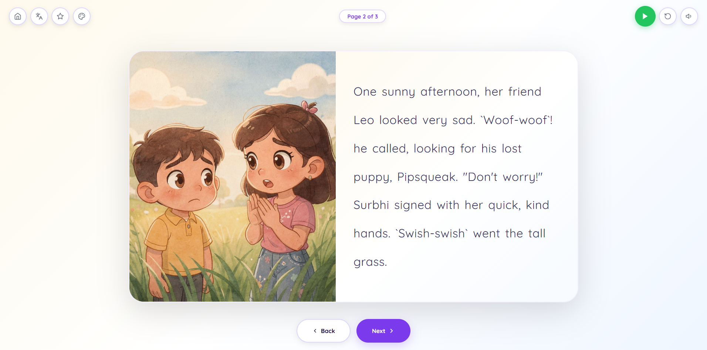 | 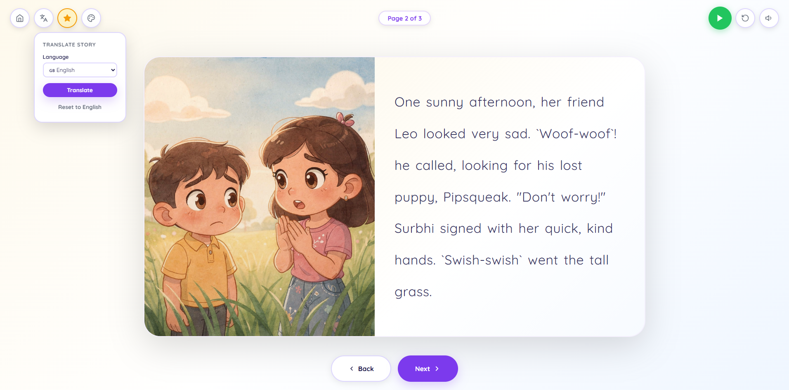 |

### Credits & Admin

| My Credits | Credit History | Admin Dashboard |
|:----------:|:--------------:|:---------------:|
| 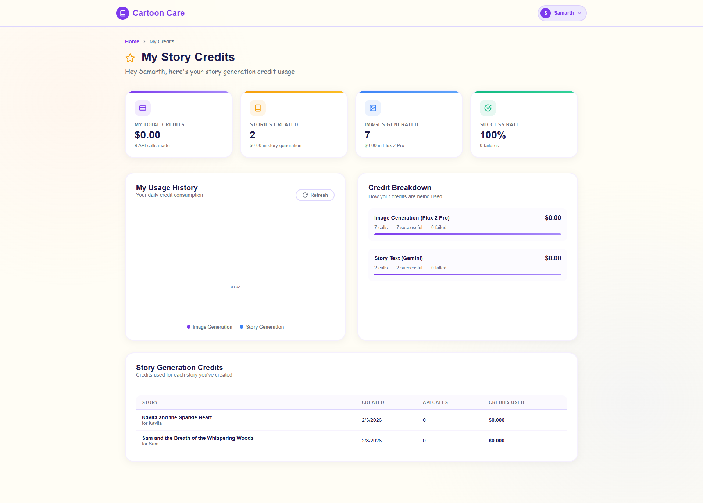 | 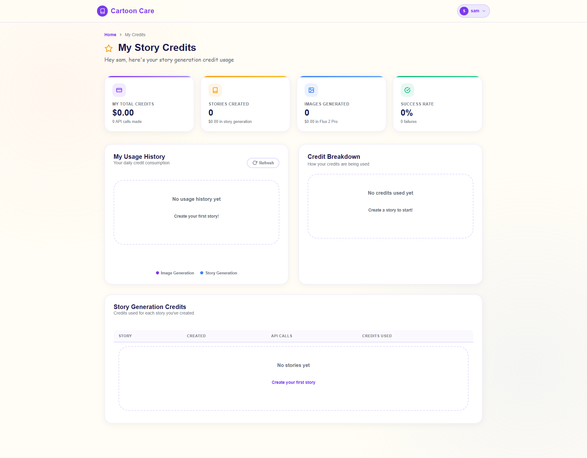 | 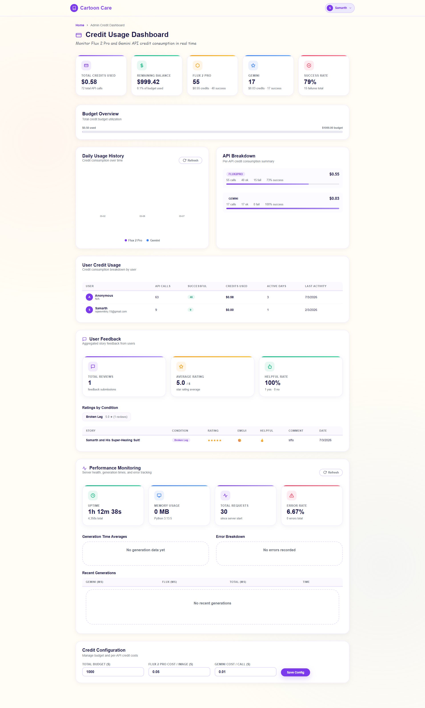 |

### Help & Support

| Feedback Dashboard |
|:------------------:|
| 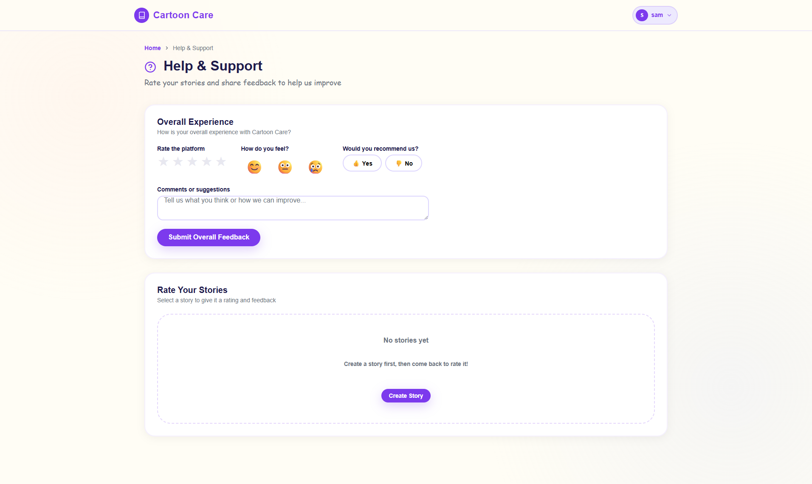 |

---

## License

Built as a 2nd Year AIML Mini Project.

---

## Contributing

1. Fork the repository
2. Create a feature branch: `git checkout -b feature/my-feature`
3. Commit your changes following [Conventional Commits](https://www.conventionalcommits.org/)
4. Push and open a Pull Request against `main`
